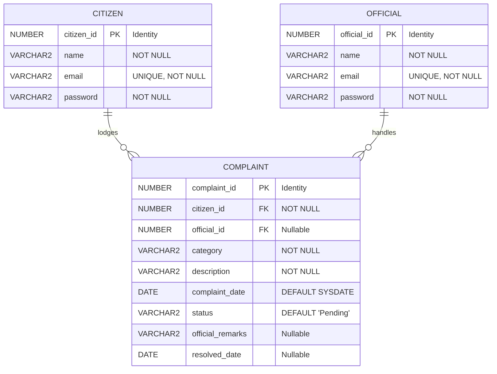

# Database Normalization Report

**Project Title:** Java Complaint Management System  
**Module:** Database Design & Normalization (Member 1)  
**Target RDBMS:** Oracle Database Free 26ai  

---

## 1. Introduction & Objectives

The goal of this database design is to create a robust, anomaly-free relational schema that enables citizens to lodge grievances and municipal/organizational officials to inspect, update, and resolve them.

A naive or unnormalized representation of complaints suffers from severe data anomalies:
* **Insertion Anomalies:** Citizens or officials cannot be registered without lodging a complaint simultaneously.
* **Update Anomalies:** If a citizen changes their email address or password, or an official updates their contact info, multiple historical records must be updated. Any omission leads to inconsistent state.
* **Deletion Anomalies:** Deleting a complaint might delete the citizen's only profile entry or an official's service history.

Through systematic relational decomposition—progressing from Unnormalized Form (UNF) through **First Normal Form (1NF)**, **Second Normal Form (2NF)**, and **Third Normal Form (3NF)**—these anomalies are completely eradicated.

---

## 2. Step-by-Step Normalization Process

### 2.1 Unnormalized Form (UNF)

In an unnormalized flat design, all citizen profile attributes, complaint attributes, and official resolution attributes reside in a single monolithic table or spreadsheet structure:

```
COMPLAINT_REGISTER_UNF (
    complaint_ref,
    citizen_name,
    citizen_email,
    citizen_password,
    official_name,
    official_email,
    official_password,
    category,
    description,
    complaint_date,
    status,
    official_remarks,
    resolved_date
)
```

**Anomalies Present in UNF:**
* **Redundant Data:** If Citizen *John Doe* lodges 5 complaints, his name, email, and password appear 5 times.
* **Mixed Entity Lifecycles:** Official authentication details and citizen profiles cannot exist independently of specific complaints.

---

### 2.2 First Normal Form (1NF)

> **Definition:** A relation is in 1NF if and only if all attribute values are atomic (indivisible) and there are no repeating groups or multi-valued attributes. A unique primary key must identify each tuple.

**Transformation to 1NF:**
1. Ensure all columns hold single scalar values (e.g., `category`, `status`, and `description` are single distinct entries per row).
2. Establish a unique identifier for the composite record.
3. Eliminate any arrays or repeating columns.

**1NF State:**
```
COMPLAINT_RECORD (
    complaint_id [PK],
    citizen_name,
    citizen_email,
    citizen_password,
    official_name,
    official_email,
    official_password,
    category,
    description,
    complaint_date,
    status,
    official_remarks,
    resolved_date
)
```

**Evaluation:**
* While values are atomic and a primary key (`complaint_id`) exists, the table continues to mix attributes describing distinct real-world entities (Citizens, Officials, Complaints).

---

### 2.3 Second Normal Form (2NF)

> **Definition:** A relation is in 2NF if and only if it is in 1NF and every non-prime attribute is fully functionally dependent on the primary key (no partial dependencies on a composite candidate key).

**Evaluation for 2NF:**
* Because our primary key `complaint_id` is a single-attribute surrogate key (not composite), partial functional dependencies on a subset of the candidate key do not formally exist.
* However, to ensure full functional dependency of entity-specific attributes and prepare for 3NF, the relation must identify candidate keys and distinct entity boundaries.

---

### 2.4 Third Normal Form (3NF)

> **Definition:** A relation is in 3NF if and only if it is in 2NF and no non-prime attribute is transitively dependent on the primary key ($X \rightarrow Y$ where $Y \rightarrow Z$ and $X \rightarrow Z$). Non-key attributes must depend *only* on the primary key, the *whole* primary key, and *nothing but* the primary key.

**Identification of Transitive Dependencies in 1NF/2NF:**
In `COMPLAINT_RECORD`, the functional dependencies are:
1. `complaint_id` $\rightarrow$ `citizen_email`, `citizen_name`, `citizen_password`
   * However, `citizen_email` functionally determines `citizen_name` and `citizen_password` (`citizen_email` $\rightarrow$ `citizen_name`, `citizen_password`).
   * Therefore: `complaint_id` $\rightarrow$ `citizen_email` $\rightarrow$ (`citizen_name`, `citizen_password`) is a **transitive dependency**.
2. `complaint_id` $\rightarrow$ `official_email`, `official_name`, `official_password`
   * Similarly, `official_email` $\rightarrow$ `official_name`, `official_password`.
   * Therefore: `complaint_id` $\rightarrow$ `official_email` $\rightarrow$ (`official_name`, `official_password`) is a **transitive dependency**.

**Decomposition into 3NF Tables:**
To eliminate these transitive dependencies, we decompose the monolithic table into three independent, cohesive relations:

#### Table 1: `CITIZEN`
Stores citizen profile and authentication details exclusively.
* **Attributes:** `citizen_id` [PK], `name`, `email` [UNIQUE], `password`
* **Determinants:** `citizen_id` is the primary key. All non-key attributes (`name`, `email`, `password`) depend strictly on `citizen_id`.

#### Table 2: `OFFICIAL`
Stores government official profiles and credentials independently of complaints.
* **Attributes:** `official_id` [PK], `name`, `email` [UNIQUE], `password`
* **Determinants:** `official_id` is the primary key. All non-key attributes depend strictly on `official_id`.

#### Table 3: `COMPLAINT`
Stores the grievance incident and workflow lifecycle state.
* **Attributes:** `complaint_id` [PK], `citizen_id` [FK], `official_id` [FK, nullable], `category`, `description`, `complaint_date`, `status`, `official_remarks`, `resolved_date`
* **Determinants:** `complaint_id` is the primary key. Attributes like `category`, `description`, `complaint_date`, `status`, `official_remarks`, and `resolved_date` pertain directly and exclusively to the individual complaint incident.

---

## 3. Entity Relationships & Integrity Constraints



### 3.1 Relationships & Cardinality

1. **`CITIZEN` to `COMPLAINT` (1 to Many):**
   * One citizen can lodge zero, one, or many complaints ($1 : N$).
   * Every complaint must be lodged by exactly one registered citizen (`citizen_id NOT NULL`).
   * **Referential Action:** Standard constraint with **no cascade delete**. If a citizen record is targeted for deletion, complaints lodged by them are preserved as audit trails and municipal public records.

2. **`OFFICIAL` to `COMPLAINT` (1 to Many, Optional):**
   * One official may be assigned to review zero, one, or many complaints ($1 : N$).
   * A complaint may initially have **no assigned official** when first lodged (`official_id NULL`, `status = 'Pending'`).
   * **Referential Action:** Defined with **`ON DELETE SET NULL`**. If an official resigns or their account is deactivated, the complaint remains in the database with `official_id = NULL` so another official can be reassigned to it without losing historical grievance records.

### 3.2 Domain Constraints
* **`status` Check Constraint:**
  Enforces acceptable lifecycle values at the database level:
  $$\text{status} \in \{\text{'Pending'}, \text{'In Progress'}, \text{'Resolved'}\}$$
* **Unique Constraints:**
  Enforces uniqueness of email addresses across both `CITIZEN.email` and `OFFICIAL.email` to prevent collision during authentication.

---

## 4. Normalization Summary Table

| Normal Form | Requirement | Project Implementation & Proof |
| :--- | :--- | :--- |
| **1NF** | Atomic attributes, primary key, no repeating groups. | All columns hold scalar values. Surrogate auto-generated identity keys (`citizen_id`, `official_id`, `complaint_id`) uniquely identify each row. |
| **2NF** | In 1NF and no partial dependencies on composite keys. | All tables use single-column primary keys, inherently eliminating partial key dependencies. |
| **3NF** | In 2NF and no transitive dependencies on non-key attributes. | Citizen details (`name`, `email`, `password`) and Official details are segregated into dedicated parent tables. `COMPLAINT` retains only foreign keys referencing them. |

---

## 5. Academic Conclusion
The final 3-table schema (`CITIZEN`, `OFFICIAL`, `COMPLAINT`) satisfies all requirements for **Third Normal Form (3NF)**. It guarantees data consistency, prevents redundant record storage, protects historical integrity, and aligns seamlessly with Java JDBC application models.
